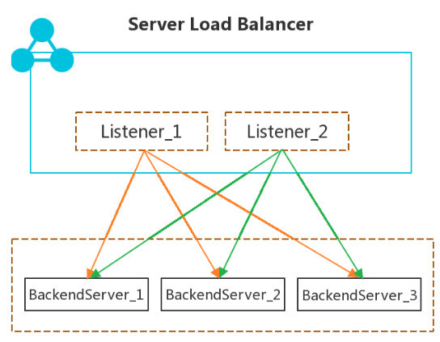
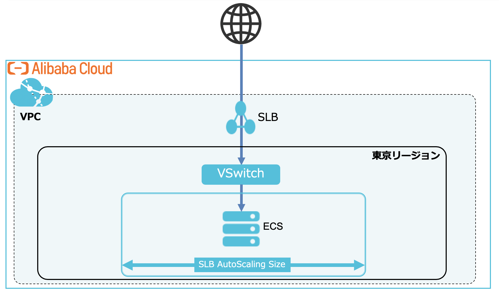

# 第11章
## AlibabaCloud SLBについて

&nbsp; 第8章までは Terraformのインストール方法、コード記載方法、実行方法を説明しました。第9章-第16章はユーザ各自でコード作成、応用ができるよう、AlibabaCloudの基本プロダクトサービスの説明を通じて解説します。

* 第9章：AlibabaCloud VPC
* 第10章：AlibabaCloud ECS、EIP
* **第11章：AlibabaCloud SLB**
* 第12章：AlibabaCloud AutoScale
* 第13章：AlibabaCloud OSS
* 第14章：AlibabaCloud RDS
* 第15章：AlibabaCloud RAM
* 第16章：AlibabaCloud Kubernetes

各章それぞれサンプルを交えて説明します。


<br>
### 11.1 SLB
&nbsp; SLB（Server Load Balancer）はアプリケーションや Web サイトのトラフィックを分散させるサービスです。

&nbsp; SLB は、仮想サービスアドレスを設定することによって、追加の ECS インスタンスを高性能で可用性の高いアプリケーションサービスプールに仮想化し、クライアントからのリクエストを、 転送ルールに従ってサーバープール内のECS インスタンスに分配します。

&nbsp; また、SLB は、追加されたバックエンドサーバーの状態をチェックし、異常状態の ECS インスタンスを自動的に分離します。そうすることで SPOF (単一障害点) 問題を除去し、アプリケ ーションの全体的なサービス性能を向上させます。 それに加え、Alibaba Anti-DDoS と組み合わせることで、SLB は DDoS 攻撃を防御することができます。


<br>
### 11.2 コンポーネント
&nbsp; SLBは以下のコンポーネントが含まれています。

* SLB インスタンス
SLB インスタンスは、実行中の負荷分散サービスで、着信トラフィックをバックエンドサーバーに分配します。 負荷分散サービスを使用するには、SLB インスタンスを作成します。インスタンスには少なくとも 1 つのリスナーと 2 つのバックエンドサーバーを設定する必要があります。

* リスナー
リスナーはクライアントからのリクエストをチェックし、設定されたルールに基づいてバックエンドサーバーに転送します。 また、バックエンドサーバーのヘルスチェックも実行します。

* バックエンドサーバー
バックエンドサーバーは、分散リクエストを処理するために SLB インスタンスに追加された ECS インスタンスです。 分散リクエストを処理する ECSインスタンスは、デフォルトサーバーグループ、VServer グループ、アクティブ/スタンバイサーバーグループのいずれかに追加することができます。




またServer Load Balancer (SLB) は、
ECS インスタンスの単一障害点 (SPOF)、アクティブゾーンの障害、などを防ぐ役割がありますので、SLBを組み合わせることでサービスの高可用性を実現することができます。

[参考：高可用性のベストプラクティス](https://jp.alibabacloud.com/help/doc-detail/67915.htm)

<br>
### 11.3 SLBのTerraformについて
&nbsp; 本題、SLB作成に移ります。まずは以下の構成図通り、簡単なソースを作ってみます。


```
resource "alicloud_slb" "SLB_instance" {
  name = "ELB_instance_for_terraform"
  vswitch_id = "${var.vswitch}"
  internet = true
}
resource "alicloud_slb_listener" "http" {
  load_balancer_id = "${alicloud_slb.SLB_instance.id}"
  backend_port = 80
  frontend_port = 80
  health_check_connect_port = 80
  bandwidth = -1
  protocol = "http"
  sticky_session = "on"
  sticky_session_type = "insert"
  cookie = "testslblistenercookie"
  cookie_timeout = 86400
}

resource "alicloud_slb_attachment" "default" {
  load_balancer_id = "${alicloud_slb.SLB_instance.id}"
  instance_ids = [
    "${alicloud_instance.app.*.id}",
  ]
}

output "slb_ip" {
  value = "${alicloud_slb.SLB_instance.address}"
}

```
SLBを作成する時は`alicloud_slb`、`alicloud_slb_listener`、`alicloud_slb_attachment`の３つの組み合わせが必要になります。

#### **alicloud_slb**
alicloud_slbはSLBを利用開始するために必要なパラメータです。
* `name` - （オプション）SLBの名前。
* `vswitch_id` - （必須）接続したいVSwitchのID。 
* `internet` - （オプション）trueの場合、SLB addressTypeはインターネットになり、falseはイントラネットになります。デフォルトはfalseです。

実行することにより、以下の属性情報が出力されます。
* `address` - ロードバランサのIPアドレス。

他に入力パラメータ、出力パラメータがいくつかありますので、[こちらも是非参照](https://www.terraform.io/docs/providers/alicloud/r/slb.html)してみてください。
https://www.terraform.io/docs/providers/alicloud/r/slb.html


#### **alicloud_slb_listener**
alicloud_slb_listenerはSLBのリスナーリソースを管理するパラメータです。
* `load_balancer_id` - （必須）新しいリスナーを起動するために使用するSLBのID。
* `frontend_port` - （必須）SLBが使用するフロントエンドのポート。
* `backend_port` - （オプション）SLBが使用するバックエンドのポート。
* `protocol` - （必須）待機する通信プロトコルタイプ。[http、https、tcp、udp]のいずれかを使用。
* `bandwidth` - （任意）Listenerのピーク帯域幅。

SLB_ListenerはSLBの心臓部でもあり、他に入力パラメータ、出力パラメータがいくつかありますので、[こちらも是非参照](https://www.terraform.io/docs/providers/alicloud/r/slb_listener.html)してみてください。
https://www.terraform.io/docs/providers/alicloud/r/slb_listener.html


#### **alicloud_slb_attachment**
alicloud_slb_attachmentはバックエンド・サーバーグループ(ECSインスタンス)をSLBに追加するパラメータです。
* `load_balancer_id` - （必須）ロードバランサーのID。
* `instance_ids` - （必須）SLBに追加されたバックエンドサーバーへのインスタンスIDのリスト。

<br>
第17章にSLBの実際の構築サンプルを入れていますので、こちらも参照してみてください。

[17章 example: SLB設定サンプル](docs/17/SLB-Setting-Sample.md)
