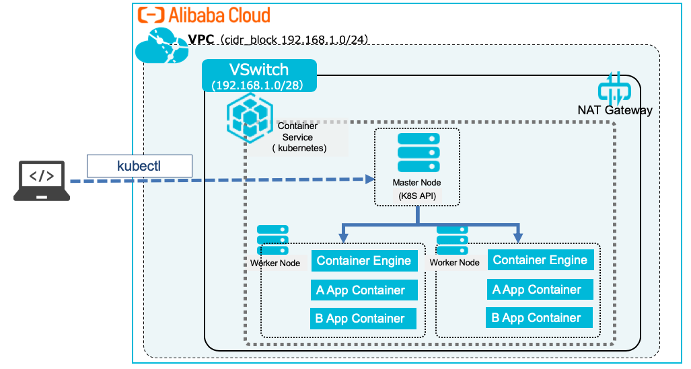

# 第20章
## example: kubernetes設定サンプル

&nbsp; 第8章までは Terraformのインストール方法、コード記載方法、実行方法、第9章-第16章はAlibabaCloudの基本プロダクトサービスの説明をしました。第17章-第24章はTerraformのサンプルコードを交えて解説します。

* [17章 example: ssh踏み台サーバ](docs/17/Bastion-Server.md)
* [18章 example: SLB設定サンプル](docs/18/SLB-Setting-Sample.md)
* [19章 example: RDS設定サンプル](docs/19/RDS-Setting-Sample.md)
* **[20章 example: kubernetes設定サンプル](docs/20/Kubernetes-Setting-Sample.md)**
* [21章 example: Webアプリケーション](docs/21/Web-Application.md)
* [22章 example: 高速コンテンツ配信](docs/22/Accelerated-Content-Delivery.md)
* [23章 example: オートスケーリング](docs/23/Auto-Scaling.md)
* [24章 example: KubernetesによるコンテナでWordPress作成](docs/24/Web-Application-on-Kubernetes.md)
* [25章 example: ECサイト構築](docs/25/EC-Site-Sample.md)

<br>
### 20.1 kubernetes設定サンプル
&nbsp; 簡単なkuberntesクラスターを作ってみます。シングルゾーンによるクラスタでの作成になります。ゴールの構成図は以下の通りです。



<br>
ソースは以下になります。サンプルソースは[こちら]()にあります。

<br>
main.tf
```
provider "alicloud" {
  access_key = "${var.access_key}"
  secret_key = "${var.secret_key}"
  region = "${var.region}"
}

resource "alicloud_vpc" "vpc" {
  name = "${var.project_name}-vpc"
  cidr_block = "192.168.1.0/24"
  description = "Enable k8s-Sample vpc"  
}

resource "alicloud_vswitch" "vsw" {
  name = "${var.project_name}-vswitch"  
  vpc_id            = "${alicloud_vpc.vpc.id}"
  cidr_block        = "192.168.1.0/28"
  availability_zone = "${var.zone}"
  description = "Enable k8s-Sample vswitch"  
}

resource "alicloud_cs_kubernetes" "k8s" {
  name                  = "${var.project_name}-k8s"  
  vswitch_ids           = ["${alicloud_vswitch.vsw.id}"]
  availability_zone     = "${var.zone}"
  new_nat_gateway       = true
  master_instance_types  = ["ecs.xn4.small"]
  worker_instance_types  = ["ecs.xn4.small"]
  worker_numbers        = [2]
  master_disk_size      = 40
  worker_disk_size      = 100
  password              = "${var.k8s_password}"
  pod_cidr              = "172.20.0.0/16"
  service_cidr          = "172.21.0.0/20"
  enable_ssh            = true
  install_cloud_monitor = true
}
```
<br>
variables.tf
```
variable "access_key" {}
variable "secret_key" {}
variable "region" {}
variable "zone" {}
variable "project_name" {}
variable "k8s_password" {}

```
<br>
output.tf
```
output "cluster_id" {
  value = ["${alicloud_cs_kubernetes.k8s.*.id}"]
}
output "worker_nodes" {
  value = ["${alicloud_cs_kubernetes.k8s.*.worker_nodes}"]
}
output "master_nodes" {
  value = ["${alicloud_cs_kubernetes.k8s.*.master_nodes}"]
}
```
<br>
confing.tfvars
```
access_key = "LTAI9V3rQftxI2TJ"
secret_key = "JA0psSnhsd8TaMWhZDeEtP1mWSpA8q"
region = "ap-northeast-1"
zone = "ap-northeast-1a"
project_name = "Kubernetes-Sample-for-Terraform"
k8s_password = "!Password2019"
```
<br>
provisioning.sh
```
```
<br>
### 20.2 実行
&nbsp; ソースの準備ができたら実行します。

```
terraform init
terraform play -var-file="confing.tfvars"
terraform apply -var-file="confing.tfvars"
```

<br>
これで問題なく実行できたら、cluster_id、worker_nodes、master_nodesが表示され、こうしてkubernetesクラスター操作、管理ができます。
<br>


